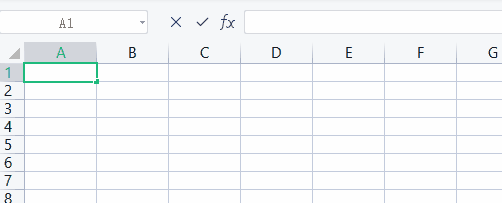

## 认识Rxjs

什么是Rxjs，官网是这么定义的： **R**eactive E**x**tensions For **J**ava**S**cript

```txt
RxJS is a library for reactive programming using Observables, to make it easier to compose asynchronous or callback-based code. This project is a rewrite of Reactive-Extensions/RxJS with better performance, better modularity, better debuggable call stacks, while staying mostly backwards compatible, with some breaking changes that reduce the API surface
```

翻译过来的大致意思是：

```txt
RxJS 是一个使用可观察对象进行响应式编程的库，可以更轻松地编写异步或基于回调的代码。该项目是对 Reactive-Extensions/RxJS 的重写，具有更好的性能、更好的模块化、更好的可调试调用堆栈，同时保持大部分向后兼容，并进行了一些减少 API 表面的重大更改。
```

上面的翻译内容有几个关键词，可有助于大致理解Rxjs。

# 响应式编程

Reactive Programming  简称 RP。是一种**面向数据流和变化传播**的编程范式。这意味着可以在编程语言中很方便地表达**静态**或**动态**的**数据流**，而**相关的计算模型**会自动将变化的值通过数据流进行传播。

上面这段解释是从某度到的，看起来说的很简单，但是要是头一次了解估计也会劝退大部分人了。我把上面比较关键的部分加粗了一下，下面我们进一步使用代码或者场景来说明这些词汇。

## 面向数据流和变化传播

在Rxjs中，会把**任何数据**或者**需要处理的对象**都抽象为一个叫做**流**的东西，这个**流**跟文件读写模型中定义的**文件流**很相似，亦或者说你可以把这个流想象为**一根水管中的水流**。

*为什么是水管，以下会有解释*

### 场景示例

公式计算是Excel中很强大的功能之一了，设定好公式之后，只要某一单元格中的数字发生了变化，相应的单元格会自动根据设定的公式计算出最后的结果。



我们可以用Rxjs中的`Subject`来模拟实现上述功能：

```ts
const a$ = new Subject<number>();						// a$ 单元格A1
const b$ = new Subject<number>();						// b$ 单元格B1

// 当a$和b$都发射了值的时候才会收到订阅的内容
const c$ = combineLatest([a$, b$]).pipe(				// c$ 单元格C1  	pipe 的本意就是管道（水管）
	map(([a, b]) => a + b)								// pipe 中通过操作符 map 模拟设定计算公式 SUM(a + b)
);

c$.subscribe(a => {										// 订阅
  console.log('结果是：', a);
});

a$.next(1);	// a$ 发射值, 单元格A1修改值了
b$.next(2); // b$ 发射值, 单元格B1修改值了 输出结果是：3	（1 + 2 = 3）

b$.next(4); // b$ 发射值, 单元格B1修改值了 输出结果是：5  （1 + 4 = 5）

```

通过上方的代码示例可以基本了解到Rxjs中的`Subject`有哪些特点以及API

[代码演示](https://stackblitz.com/edit/rxjs-ql3naq?devtoolsheight=33&file=index.ts)

#### Subject 

Subject是一个类，继承于`Observable`, 需要实例化。他有`pipe`、`next`、`subscribe`方法。

*Observable 的字面意思是可观察对象，下面会解释*

`next` 该方法是`Subject`才会有的实例方法，他用于发射（更改）`Subject`中的值

`subscribe` 的字面意思就是订阅，他是`Observable`中的方法，只有调用了该方法，那么该对象管道内的操作符方法才会被调用执行。

`pipe`的字面意思就是管道（水管），他是`Observable`中的方法，`pipe`中传入的参数被称作操作符（**`operator`**），操作符可以有多个，他们决定了数据的流向。

为了方便理解，我打开了很久没玩过的马里奥派对，截了张图，看图的`右侧`：


这个是划船游戏，`起点`在最下方，在划船的过程中你可以选择走`不同的河道（向左划或者向右划）`，在最上方是分别对应着5个不同的终点,。那么这个跟`pipe`有什么关系呢？

`不同的河道`我们可以将其看作操作符（**`operator`**），从起点到终点整个划船运动轨迹你可以看作为一个`pipe`。

##### Operator

说到`pipe`就不得不说说操作符了，在划船游戏中，`不同的河道遇到的障碍是不一样的`，可理解为每一个操作符的作用是不一样的，在Rxjs中操作符的数量大概是113个。这个数量大概也能劝退一部分人了，不过不用慌，在一般情况下，常用的也就那么几个。`关于常用的操作符，这个我们以后再说`。

#### 思考

上方模拟Excel单元格公式计算的示例和过程是不是很像vue3里面的`reactive`？

### 静态数据流

TODO...

### 动态数据流

TODO...s

## 可观察对象

在Rxjs中，`Observable`是整个Rxjs中最关键、最核心的类，字面意思就是`可观察`, 所以属于`Observable`类型的对象都称之为`可观察对象`, 像上方代码示例中的`Subject`就是`Observable`的派生类，所以`Subject`也是可观察对象。

下面是一段使用`Observable`的代码示例

```ts
const observable$ = new Observable<number>(
  // 当Observable被订阅时，本函数才会执行
  (subscribe) => {
    // subscribe 类似 Promise中 resolve 和 reject的集合体
    let i = 0;
    const timer = setInterval(() => {
      // 每隔1秒发射一次值
      // 这里相当于Promise.resolve()
      subscribe.next(i++);
      if (i === 5) {
        // 完成状态，类似将Promise的状态设置为fulfilled
        // 当调用 subscribe.complete() 方法后，进入清理资源的方法
        subscribe.complete();
      }
    }, 1000);
    // 清理资源
    // 当订阅者调用 unsubscribe() 方法后 或者 subscribe.complete()方法被调用之后将进入下面清理资源的方法
    return () => {
      console.log('清理资源....');
      clearInterval(timer); // 清理
    };
  }
);

// 订阅 相当于 Promise.then()
const subscription = observable$.subscribe((value) => {
  console.log(value); // 每隔1秒打印一次值，打印5次之后不再打印
});

// subscription.unsubscribe(); // 取消订阅
```

[代码演示](https://stackblitz.com/edit/rxjs-5xwjpt?devtoolsheight=33&file=index.ts)

#### `Observable`与 `Subject`的区别

通过上面的代码可以看到，虽然`Subject`与`Observable`之间是继承关系，但是他们的使用方式很不一样。

`Observable` 的构造函数需要传入一个参数--被订阅者, 被订阅者是一个函数，可以把他理解为一个回调函数，这个回调函数中有一个参数`subscribe`，**当Observable被订阅时 `.subscribe()` ，才会执行这个回调函数。**

```ts
// 可观察对象
const observable$ = new Observable<number>(
  // 被订阅者
  (subscribe) => {
    subscribe.next(1);                  // next方法用于发射值，通知给观察者
    subscribe.next(2);
    subscribe.next(3);
    subscribe.complete();               // complete方法将内部状态标记为已完成，同时通知给观察者。被标记完成后会进入清理资源的函数
    // subscribe.error('出现错误');          //  error方法被调用之后，会自动取消订阅, 同时通知给观察者
    subscribe.next(4);                  // 上方的 complete 或者 error方法被调用之后，这里执行了也不会通知给观察者
    // 清理资源
    return () => {
      console.log('清理资源');
    };
  }
);

// 订阅1
const sub1 = observable$.subscribe(
  // 观察者, 或者称之为订阅者
  {
    next(value) {
      console.log(value, 'in sub1');
    },
    complete() {
      console.log('complete');
    },
    error(err) {
      console.log('error:', err);
    },
  }
);

// 取消订阅
// sub1.unsubscribe();

// 订阅2
const sub2 = observable$.subscribe((value) => {
  console.log(value, 'in sub2!');
});

```

[代码演示](https://stackblitz.com/edit/rxjs-apmwjd?devtoolsheight=33&file=index.ts)

`Subject` 的构造函数没有参数，他屏蔽了父类`Observable`构造函数的参数。 实际上他自己本身就是被订阅者，换句话说他本身就有跟被订阅者相同行为的方法`next`,`complete`,`error`

```ts
const subject1 = new Subject<number>();
const sub1 = subject1.subscribe(
  // 观察者, 或者称之为订阅者
  {
    next(value) {
      console.log(value, 'in sub1');
    },
    complete() {
      console.log('complete', 'in sub1');
    },
    error(err) {
      console.log('error:', err, 'in sub1');
    },
  }
);

// 取消订阅1
// sub1.unsubscribe();

// Subject 示例本身就是一个被订阅者，所以拥有被订阅者的相同的行为
subject1.next(1);                  // next方法用于发射值，通知给观察者
subject1.next(2);
subject1.next(3);

subject1.complete();               // complete方法将内部状态标记为已完成，同时通知给观察者。被标记完成后会进入清理资源的函数
// subject1.error('出现错误');          //  error方法被调用之后，会自动取消订阅, 同时通知给观察者
subject1.next(4);                  // 上方的 complete 或者 error方法被调用之后，这里执行了也不会通知给观察者

// 订阅2 
// 在Subject发射值之后，订阅得不到任何值
const sub2 = subject1.subscribe(
  // 观察者, 或者称之为订阅者
  {
    next(value) {
      console.log(value, 'in sub2');
    },
    complete() {
      console.log('complete', 'in sub2');
    },
    error(err) {
      console.log('error:', err, 'in sub2');
    },
  }
);

// 取消订阅2
// sub2.unsubscribe();
```

[代码演示](https://stackblitz.com/edit/rxjs-vb942q?devtoolsheight=33&file=index.ts)

总结一下就是一下2点：

1. `Observable`将被订阅者收敛到构造函数内部中去了，只有订阅之后才会执行被观察者函数。一般来说相同的条件的前提下，每一个订阅者收到的结果是一样的。
2. 而`Subject`本身就是一个被订阅者，可以在任意时间发射值，**但是在不同的时间点订阅Subject收到的值会不一样**。


## 异步或者基于回调的代码


#### `Observable`与`Promise`的区别

由于`Observable`也可以很好的处理异步任务，所以经常会拿来跟`Promise`作比较。他们的API除了名称不一样，使用方式却非常相似。不过他们的内部执行过程完全不一样。

以下是`Observable`与`Promise`之间的区别。

|                       | Promise                                                      | Observable                                                   |
| :-------------------- | ------------------------------------------------------------ | ------------------------------------------------------------ |
| ECMAScript 标准       | ES6规范，javascript原生对象                                  | 不属于ES6规范，属于第三方库                                  |
| 支持async/await语法糖 | 支持                                                         | 不支持                                                       |
| 异步/同步任务         | 是异步任务，属于微任务                                       | 是不是异步/同步任务，取决于当前执行的代码是否属于异步/同步任务 |
| 执行时机              | 被实例化之后会立即执行构造函数中传入的任务（函数）           | 被订阅之后才会执行                                           |
| 数据发射              | resolve() 方法只在第一次调用的时候有效，所以**只会发射一次**，换句话说他是一次性的。 | `subscribe.next()`可以多次调用，直到`subscribe.complete()`或者`subscribe.error() `方法被调用后 |
| 取消                  | 被实例化之后立即执行，所以没有取消操作                       | 订阅之后才会执行，可以随时取消订阅                           |


## Reactive-Extensions

实际上Reactive-Extensions 是一个大家族，分别运行在各个编程语言/平台之中，可以从命名规则推导其运行环境。例如 Rxjs 作为其中一员，运行在JavaScript之中，RxJava为 Java 的一个库，Rx.NET运行在.NET环境中，依次类推还有RxSwift、RxCpp、RxPython等。

你可以在[这里]([ReactiveX - Languages](https://reactivex.io/languages.html))找到是否存在相关实现。

虽然Rxjs的兄弟们分别运行在不同的编程语言/平台之中，但是API却是近乎相同，例如在C#中引入Rx.NET:

```C#
using System.Reactive;
using System.Reactive.Subjects;

class Program
{
    static void Main(string[] args)
    {
        // Console.WriteLine("Hello world!");
        var subject = new Subject<Int32>();

        subject.OnNext(123); 				// 发射只
        IDisposable sub = subject.Subscribe(value => {
            Console.WriteLine($"第一个订阅{value}");
        });
        subject.OnNext(345);
        subject.Subscribe(value => {
            Console.WriteLine($"第二个订阅{value}");
        });
        subject.OnNext(555);
        
        sub.Dispose(); // 取消订阅
    }
}

```

回到正题，最上面的翻译有提到Rxjs是对[Reactive-Extensions/RxJS](https://github.com/Reactive-Extensions/RxJS)的重写, 正如链接中指向的git仓库那样，这个仓库已经被设置为readonly了，并且最新的版本是4.1.0。而本文中的Rxjs仓库地址是[这里]([ReactiveX/rxjs: A reactive programming library for JavaScript (github.com)](https://github.com/reactivex/rxjs)), 截至到目前为止，最新的版本是7.5.4。换句话说就是4.x版本就是老的Rxjs，而5.x以及之后的版本就是被重写之后的新版Rxjs。**从编码体验上看**，他们最大的区别就是调用操作符的方式不一样。

旧的Rxjs库：

```ts
const source = new Subject<{ price: number }>();

// 没有pipe方法，链式调用操作符
const subscription = source
  .filter(quote => quote.price > 30)
  .map(quote => quote.price)
  .subscribe(
    price => console.log(`Prices higher than $30: ${price}`),
    err => console.log(`Something went wrong: ${err.message}`)
  );

/* When we're done */
subscription.dispose(); // 取消订阅的API是dispose()
```

至于重写的原因，上文也给出了说明，更好的性能，模块化，可调试调用堆栈。


## 模块化

在如日中天（超级内卷）的前端领域，为了更好的用户体验，TODO...


## 可调试调用堆栈

TODO...

## 向后兼容

TODO...

