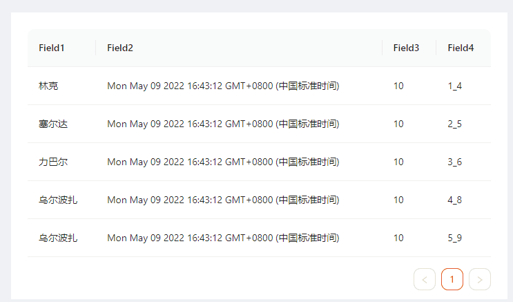

## 什么是指令

以下是摘自 [angular.cn](https://angular.cn) 中对指令的描述。

```txt
指令是为 Angular 应用程序中的元素添加额外行为的类。
```

这句话中的重点在于**为元素添加额外行为**, 我们都知道，在ng中，组件也是一个元素，它最终也是html中的一个DOM节点。换句话说，指令不单能为HTML节点元素添加指令，也可以为组件节点添加指令。

例如, 为`HTML`节点添加指令， 其中 `nz-input` 和 `formControlName`都是指令

```html
<input nz-input formControlName="user_name" />
```

为组件添加指令: `nz-select`是一个自定义组件，`formControlName`是一个指令

```
<nz-select formControlName="user_name">
	<nz-option nzLabel="" nzValue=""></nz-option>
</nz-select>
```


## 使用场景案例

### 简单的使用场景

以上面为`HTML`节点添加属性指令为例, 我们重点探讨一下`nz-input`这个属性指令，翻开源码我们可以看到，它做的绝大部分事情是根据传入的`@Input`属性来控制`input`元素的外观，整个代码100行都不到，非常简单。有兴趣可以去 [看看](https://github.com/NG-ZORRO/ng-zorro-antd/blob/master/components/input/input.directive.ts) ，这里就不深入展开了。

### 复杂的使用场景

接下来，才是我们要探讨的主题，一个复杂的使用场景，也是很常见的一个场景。描述如下：

1. 一个数据表格，要求可以在单元格内编辑。由于表格的列太多，所以交互可以做成**点击单元格后弹出一个窗口**，在窗口呈现表单进行编辑。
2. 不同的单元格中的数据类型可能不一样，有普通文本，有日期，有文本拆分成多个表单控件分开编辑，可能需要验证。
3. 表单验证通过后可点击保存按钮，然后提交至服务端。
4. 提交到服务端的数据是字符串，一些需要拆分多个控件的表单需要格式化后再提交。


以上场景的分析：

**共同点**：

1. 不管是什么数据类型的单元格编辑都需要弹出窗口，
2. 窗口里面一定都是表单
3. 表单都会有验证。
4. 验证通过后关闭窗口，并提交数据。


**不同点**：

1. 单元格的数据类型不一样
2. 表单内的控件不一样，或者说表单的结构不一样
3. 提交数据前可能需要格式化表单数据。


根据以上的分析结果，我们可以确定的是，**除了表单UI界面需要呈现的不一样之外，其他的交互逻辑基本都是相同的**。本次我们探讨的是属性指令的使用场景，所以，首先创建一个属性指令，用于**封装`共同点`**,即

1. 负责创建表单
2. 负责弹出窗口，呈现表单控件
3. 负责验证表单的有效性
4. 负责格式化表单控件中的数据
5. 负责往外`Emit`修改后的数据


```ts

@Directive({
    selector: '[editable-cell]'
})
export class EditableCellDirective implements OnInit {
    
    @Output() valueChange = new EventEmitter<string>();
    
    constructor(public modalService: NzModalService, public fb: FormBuilder) {}
    
    createFormGroup(): FormGroup {
        return this.fb.group({
            
        })
    }
    
    openModal(): void {
        const formGroup: FormGroup = this.createFormGroup(); // 创建表单 
        const modalRef = this.modalService.create({
            nzTitle: '',
            nzContent: '', // ?? 访问组件内的模板 template
            nzComponentParams: {
            	formGroup
        	},
            nzFooter: [
               { 
                  label: '保存',
                  disabled: () => formGroup.invalid,
                  onClick:() =>{
            		const value = formGroup.value;
                    this.valueChange.emit(value);
        		  }                                
               }                                   
            ]                                  
        })
    }
}
```


指令准备好之后， 我们先创建一个组件，**主要的职责**是用于提供给指令弹出窗口时需要使用的表单模板。

```ts
@Component({
    selector: 'input-cell',
    template: `
    	<!-- 弹出窗口需要使用的表单模板 -->
    	<ng-template let-data>
    		<form [formGroup]="data.formGroup">
    			<input nz-input formControlName="text" />
    		</form>
    	</ng-template>
    	<div>{{ cellValue }}</div>
    `
})
export class InputCellComponent implements OnInit {
    @Input() cellValue!: string;
    // 在视图中查找表单模板
    @ViewChild(TemplateRef, { static: true }) template!: TemplateRef<void>;
    
    constructor(){
    }
    
    ngOnInit(): void {
    }
}

```

嗯，一切准备就绪，但是好像又又点儿问题。

1. 目前属性指令跟组件目前没什么**关联**。
2. 作为共同点之一，属性指令不应该创建表单，应该是获取创建后的表单对象。
3. 作为共同点之一，属性指令不应该在提交之前格式化表单的值。
4. 点击单元格（`div`）的时候需要弹出窗口，但是弹出窗口的逻辑在属性指令里面，组件需要访问属性指令里面的方法。
5. 上面不应该做的事情，都应该是由组件来做。


大致有数了..首先先建立属性指令和组件的关联，需要声明一个`InjectionToken`：

```ts
export const EDITABLE_CELL = new InjectionToken<void>('EDITABLE_CELL');
```

再声明一个`interface`：

```ts
export interface IEditableCell {
    // 窗口的标题
    modalTitle: string;
    // 窗口的表单内容模板
    template: TemplateRef<void>;
    // 为组件注册一个创建表单的方法
    createForm(fb: FormBuilder): FormGroup;
    // 为组件注册一个打开弹出窗口的方法
    registerOnOpenModal(fn: () => void): void;
    // 为组件注册一个格式化表单值的方法
    formatFormValue(value: any): string;
}
```


把组件的代码改造一下，实现`IEditableCell`接口，声明提供者`EDITABLE_CELL`，告知属性指令。

```ts
@Component({
    selector: 'input-cell',
    template: `
    	<!-- 弹出窗口需要使用的表单模板 -->
    	<ng-template let-data>
    		<form [formGroup]="data.formGroup">
    			<input nz-input formControlName="text" />
    		</form>
    	</ng-template>
    	<div (click)="openModal()" *ngIf="openModal">{{ cellValue }}</div>
    `,
    providers: [ { provide: EDITABLE_CELL, useExisting: InputCellComponent }] // 提供一个 EDITABLE_CELL ， 以便属性指令中能访问到本组件
})
export class InputCellComponent implements OnInit, IEditableCell { // 实现 IEditableCell 接口
    // 单元格的值
    @Input() cellValue!: string;
    // 弹窗标题
    @Input() modalTitle!: string;
    // 在视图中查找表单模板
    @ViewChild(TemplateRef, { static: true }) template!: TemplateRef<void>;
    
    // 打开窗口
    openModal!:() => void;

    constructor(){
    }
    
    // 创建表单
    createForm(fb: FormBuilder): FormGroup {
        return fb.group({
            text: [this.cellValue]
        })
    }
    
	// 注册一个打开弹出窗口的方法
    registerOnOpenModal(fn: () => void): void {
		this.openModal = fn;
    }
    
	// 格式化表单的值
    formatFormValue(value: any): string {
        const { text } = value;
        return text;
    }
    
    ngOnInit(): void {
    }
}
```


改造属性指令:

```ts

@Directive({
    selector: '[editable-cell]'
})
export class EditableCellDirective implements OnInit {
    // 如果值发生了变化，通知给外部
    @Output() valueChange = new EventEmitter<string>();
    formGroup!: FormGroup;
    
    // 打开窗口
    openModal = () => {
        const modalRef = this.modalService.create({
            nzTitle: this.component.modalTitle,
            nzContent: this.component.template, // 访问组件内的模板 template
            nzComponentParams:{
            	formGroup: this.formGroup
        	},
            nzFooter: [
               { 
                  label: '保存',
                  disabled: () => this.formGroup.invalid,
                  onClick:() =>{
            		const value = this.component.formatFormValue(this.formGroup.value); // 在这里格式化表单的值
                    modalRef.close(value); // 关闭窗口，并返回值
        		  }                                
               }                                   
            ]                                  
        })
        
        // 订阅窗口关闭事件
        const sub$ = modalRef.afterClose.subscribe(value => { 
            if (value) {
            	this.valueChange.emit(value); // 往外发射值
            }
            Promise.resolve().then(() => sub$.unsubscribe()); // 取消订阅
        });
    }
    
    constructor(
    	// 注入 EDITABLE_CELL， 意味着组件实例被注入， 由于我们只需要访问接口中约定的方法，不关心到底是什么组件，所以使用接口作为类型，
    	@Inject(EDITABLE_CELL) @Self() public component: IEditableCell, 
     	public modalService: NzModalService, 
     	public fb: FormBuilder
    ) {
     	component.registerOnOpenModal(this.openModal); // 在这里把打开窗口的方法注入给组件
    }
    
    ngOnInit(): void {
        this.formGroup = this.component.createForm(this.fb); // 在这里创建表单
    }
    
}
```


OK, 到现在为止，属性指令与组件已经关联起来了，目前我们已经实现了一个**针对普通文本编辑的单元格组件**。剩下的事情就是仿照这个组件去实现编辑**日期**、**文本拆分**等单元格组件就可以了。

下面贴上代码：

编辑日期

```ts

@Component({
  selector: "date-cell",
  template: `
    <!-- 弹出窗口需要使用的表单模板 -->
    <ng-template let-data>
      <form [formGroup]="data.formGroup">
        <nz-date-picker formControlName="date"></nz-date-picker>
      </form>
    </ng-template>
    <div (click)="openModal()" *ngIf="openModal">{{ cellValue }}</div>
  `,
  changeDetection: ChangeDetectionStrategy.OnPush,
  providers: [{ provide: EDITABLE_CELL, useExisting: DateCellComponent }],
})
export class DateCellComponent implements OnInit, IEditableCell {
  @Input() modalTitle: string;
  @Input() cellValue!: Date;

  @ViewChild(TemplateRef, { static: true }) template: TemplateRef<void>;
  openModal!: () => void;

  constructor() {}
  createForm(fb: FormBuilder): FormGroup {
    return fb.group({
      date: [this.cellValue],
    });
  }
  registerOnOpenModal(fn: () => void): void {
    this.openModal = fn;
  }
  formatFormValue(value: any): string {
    const { date } = value;
    return format(date, "yyyy-MM-dd");
  }

  ngOnInit(): void {}
}
```

文本拆分

```TS

@Component({
  selector: "split-cell",
  template: `
    <!-- 弹出窗口需要使用的表单模板 -->
    <ng-template let-data>
      <form [formGroup]="data.formGroup">
        <nz-form-item nzFlex>
          <nz-form-control nzSpan="24" [nzErrorTip]="sErrorTip">
            <textarea nz-input formControlName="s"></textarea>
            <ng-template #sErrorTip let-control>
              <ng-container *ngIf="control.hasError('required')">
                必须填写！
              </ng-container>
            </ng-template>
          </nz-form-control>
        </nz-form-item>
        <nz-form-item nzFlex>
          <nz-form-control nzSpan="24" [nzErrorTip]="eErrorTip">
            <textarea nz-input formControlName="e"></textarea>
            <ng-template #eErrorTip let-control>
              <ng-container *ngIf="control.hasError('required')">
                必须填写！
              </ng-container>
            </ng-template>
          </nz-form-control>
        </nz-form-item>
      </form>
    </ng-template>
    <div (click)="openModal()" *ngIf="openModal">{{ cellValue }}</div>
  `,
  styles: [],
  changeDetection: ChangeDetectionStrategy.OnPush,
  providers: [{ provide: EDITABLE_CELL, useExisting: SplitCellComponent }], // 提供一个 EDITABLE_CELL ， 以便属性指令中能访问到本组件
})
export class SplitCellComponent implements OnInit, IEditableCell {
  @Input() cellValue!: string;
  @Input() modalTitle!: string;
  // 在视图中查找表单模板
  @ViewChild(TemplateRef, { static: true }) template!: TemplateRef<void>;

  // 打开窗口
  openModal!: () => void;

  constructor() {}

  // 创建表单
  createForm(fb: FormBuilder): FormGroup {
    const [s, e] = (this.cellValue || "").split("_");
    return fb.group({
      s: [s, [Validators.required]],
      e: [e, [Validators.required]],
    });
  }

  // 注册一个打开弹出窗口的方法
  registerOnOpenModal(fn: () => void): void {
    this.openModal = fn;
  }

  // 格式化表单的值
  formatFormValue(value: any): string {
    const { s, e } = value;
    return `${s}_${e}`;
  }

  ngOnInit(): void {}
}
```

最后是使用组件和属性指令

```TS
// 表格数据模型
interface IDataItem {
  id: number;
  field_1: string;
  field_2: Date;
  field_3: number;
  field_4: string;
}

@Component({
  selector: "app-directive-example",
  template: `
  	<nz-table #nzTable [nzData]="data" [nzPageSize]="10">
      <thead>
        <tr>
          <th>Field1</th>
          <th>Field2</th>
          <th>Field3</th>
          <th>Field4</th>
        </tr>
      </thead>
      <tbody>
        <tr *ngFor="let i of nzTable.data; let index=index">
          <td>
            <input-cell
              editable-cell
              [cellValue]="i['field_1']"
              modalTitle="Field1"
              (valueChange)="onCellValueChange($event, index, 'field_1')"
            ></input-cell>
          </td>
          <td>
            <date-cell
              editable-cell
              [cellValue]="i['field_2']"
              modalTitle="Field2"
              (valueChange)="onCellValueChange($event, index, 'field_2')"
            ></date-cell>
          </td>
          <td>
            <select-cell
              editable-cell
              [cellValue]="i['field_3']"
              modalTitle="Field3"
              (valueChange)="onCellValueChange($event, index, 'field_3')"
            ></select-cell>
          </td>
           <td>
            <split-cell
              editable-cell
              [cellValue]="i['field_4']"
              modalTitle="Field4"
              (valueChange)="onCellValueChange($event, index, 'field_4')"
            ></split-cell>
          </td>
        </tr>
      </tbody>
    </nz-table>
  `,
  changeDetection: ChangeDetectionStrategy.OnPush,
})
export class DirectiveExampleComponent implements OnInit {
  data: IDataItem[] = [
    {
      id: 1,
      field_1: "林克",
      field_2: new Date(),
      field_3: 10,
      field_4: "1_4",
    },
    {
      id: 2,
      field_1: "塞尔达",
      field_2: new Date(),
      field_3: 10,
      field_4: "2_5",
    },
    {
      id: 3,
      field_1: "力巴尔",
      field_2: new Date(),
      field_3: 10,
      field_4: "3_6",
    },
    {
      id: 4,
      field_1: "乌尔波扎",
      field_2: new Date(),
      field_3: 10,
      field_4: "4_8",
    },
    {
      id: 5,
      field_1: "米法",
      field_2: new Date(),
      field_3: 10,
      field_4: "5_9",
    },
  ];

  onCellValueChange(value: string, rowIndex: number, field: string): void {
    // TODO http request
    // console.log(value);
    this.data[rowIndex][field] = value;
  }
  constructor() {}

  ngOnInit(): void {}
}

```


下面是演示动画




## 总结

在ng里面，要实现以上的功能，方式有很多种。以上场景的解决思路来自于ng中响应式表单的实现方式。一直觉得ng的响应式表单是**属性指令**结合**组件**的最佳实践。

属性指令可以将一些固定的与UI无关的业务逻辑封装，与组件组合使用，最后再次回头看看对属性指令的描述,  正好应证了那句话：**为元素添加额外行为**。

当你的组件可能需要使用抽象service、继承父组件这样的实现时，不妨暂停一会儿，考虑一下使用属性指令去实现的可能性。


- [代码在此](https://github.com/ycpaladin/ng-examples/tree/directive-example/src/app/pages/directive-example)
- [响应式表单介绍](https://angular.cn/guide/reactive-forms)
- [响应式表单源码](https://github.com/angular/angular/tree/main/packages/forms/src/directives/reactive_directives)
- [依赖注入](https://angular.cn/guide/dependency-injection)
- [ng-zorro-antd](https://ng.ant.design/docs/introduce/zh)

